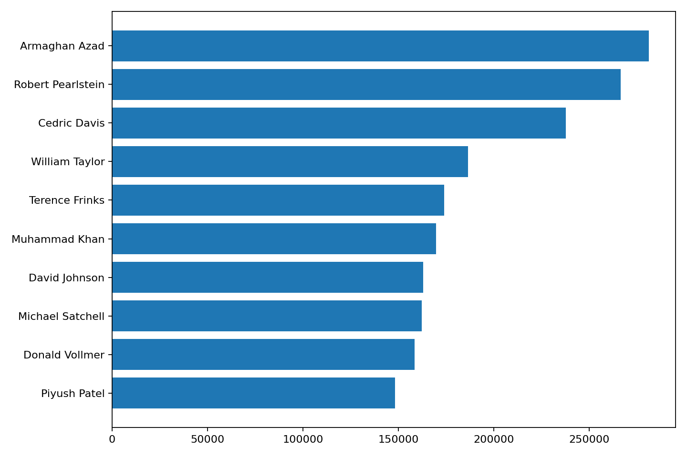
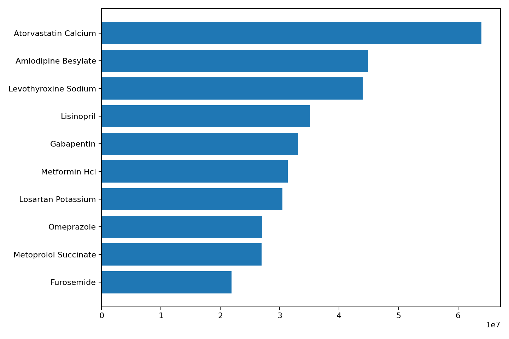
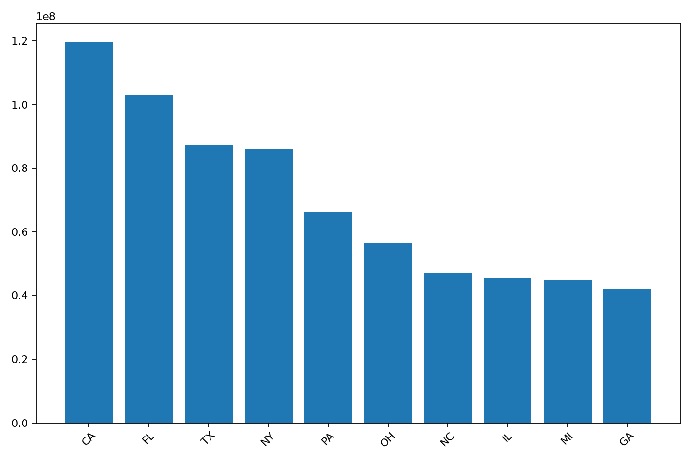

# Pharma BI Dashboard — Medicare Part D (2022)

## 🎯 Objective
Operationalize CMS Medicare Part D Prescribers (2022) into BI-ready assets for executive decisioning. The pipeline programmatically ingests raw CMS data, standardizes it, and produces lightweight extracts and visuals for rapid Power BI consumption.

---

## 📂 Data Source
- **Dataset:** Medicare Part D Prescribers — by Provider & Drug (2022)  
- **Publisher:** Centers for Medicare & Medicaid Services (CMS)  
- **Volume:** ~25M+ rows (multi-GB raw)  
- **Acquisition:** `fetch_partd_2022.py` (programmatic download)  
> Raw file is materialized under `data_raw/` and excluded via `.gitignore`.

---

## ✅ Deliverables
### Sample Datasets
- `samples/top_doctors_by_claims.csv` — Top prescribers by claim volume  
- `samples/top_drugs_by_claims.csv` — Top drugs by claim volume  
- `samples/state_summary.csv` — Claims and cost roll-up by state  

### Visual Assets
- 
- 
- 

---

## 🛠️ Reproduce (local)
```bash
python -m venv .venv
# macOS/Linux
source .venv/bin/activate
# Windows
.venv\Scripts\activate

pip install -r requirements.txt
python fetch_partd_2022.py
Outputs land in data_raw/, samples/, and assets/.

📊 Power BI Runbook

Import /samples/*.csv

Model on provider keys (NPI) and geography (State)

DAX exemplars:

Total Prescriptions = SUM('TopDoctors'[Claims])
Total Drug Cost     = SUM('TopDoctors'[Cost])
Avg Cost per Rx     = DIVIDE([Total Drug Cost], [Total Prescriptions])


Executive view:

KPI: Total Prescriptions, Total Drug Cost, Avg Cost/Rx

Bar: Top Doctors by Claims

Bar: Top Drugs by Claims

Column: Claims by State + State slicer

📁 Repository Layout
pharma-bi-dashboard/
├── fetch_partd_2022.py
├── requirements.txt
├── README.md
├── assets/
│   ├── top_doctors.png
│   ├── top_drugs.png
│   └── claims_by_state.png
├── samples/
│   ├── top_doctors_by_claims.csv
│   ├── top_drugs_by_claims.csv
│   └── state_summary.csv
└── data_raw/            # git-ignored raw payloads

🚀 Business Value

Collapses raw federal data into decision-grade artifacts

Accelerates GTM analytics (doctor targeting, channel ROI, geo heatmaps)

Demonstrates end-to-end data engineering + BI enablement in a compact footprint
